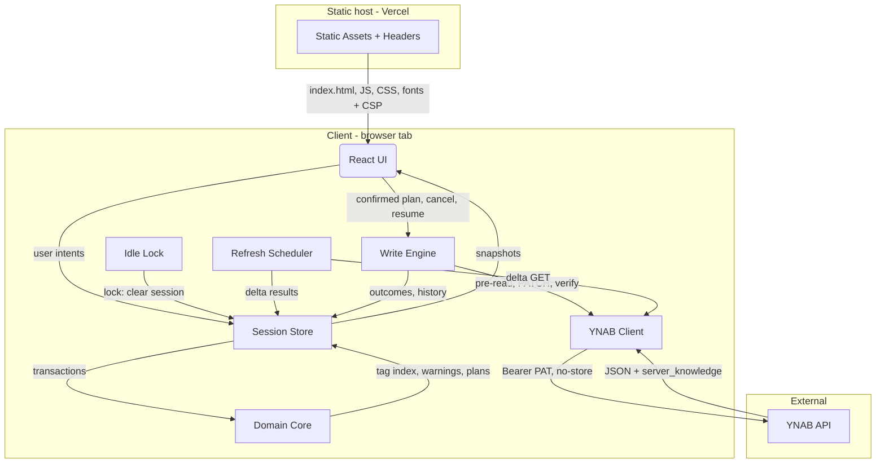

# Design Document: YNAB Tagging

## Overview

Ynot v1 is a static single-page app built with Vite+ (`vp`), React and TypeScript and deployed to Vercel on a dedicated subdomain. The browser talks straight to `https://api.ynab.com` using a Personal Access Token that exists only inside one in-memory YNAB client object. Nothing is stored anywhere except page memory and YNAB.

The code has four layers:

1. **Domain** (`src/domain/`) — pure, framework-free TypeScript. It holds the hashtag grammar, Tag Identity, membership, Tag Totals, the vocabulary and its warnings, register filtering, memo rewriting, and operation planning. It makes no network calls, reads no clocks and imports no React, so property-based tests can reach all of it.
2. **YNAB adapter** (`src/ynab/`) — a small hand-written `fetch` client, typed from YNAB's pinned OpenAPI document. It covers initial loading, delta refreshes and batched memo writes, and enforces the network boundary: only the YNAB origin, `no-store` caching, timeouts and error classification.
3. **Session runtime** (`src/session/`, `src/writes/`) — one in-memory store that owns the connection, the Budget Session, the refresh scheduler, the inactivity lock, the write engine state machine and undo history. Ending a session or switching budget drops the whole object graph.
4. **UI** (`src/ui/`) — React components built on React Aria Components for keyboard and screen-reader behaviour. The layout is desktop-first with a phone layout. There is no URL routing, so no financial data can reach a URL.

Out of scope, per the requirements: a backend, OAuth, persistence, a service worker, split-level writes, scheduled transactions, analytics, staged multi-operation plans, per-transaction selection in the Tag reader, queued writes and redo.

## Goals / Non-Goals

**Goals:**

- Enforce the privacy boundary in code and deployment: memory-only PAT and data, YNAB as the only network destination, a fail-closed CSP, and no HTTP caching of API responses (Req 1, 2, 21.6).
- Implement the settled grammar, identity, membership, totals and warning rules once, as pure functions shared by the reader, the vocabulary, the warnings and every writer (Req 7–10, 14–15).
- Make every memo rewrite provably conservative: only tag spans and at most one adjacent whitespace character change, and nothing is ever truncated (Req 12–13).
- Run writes through one state machine with a fixed scope, pre-write conflict checks, verification, pause, explicit Resume and session-only undo (Req 16–19).
- Load complete history and keep it fresh, with a request budget that fits YNAB's limit of 200 requests per hour (Req 3–4).
- Deliver every core workflow on desktop and phone, by keyboard and with a screen reader (Req 20).
- Produce the automated and manual evidence Requirement 21 demands.

**Non-Goals:**

- A server, server functions, proxy or edge middleware of any kind (Req 1.1).
- Offline support, a service worker or IndexedDB caching (Req 1.9, 22.4).
- Split-memo writes, or selection and editing of split tags (Req 22.2).
- Charts, date-ranged totals, reimbursement tracking or other analytics (Req 22.5).
- Redo, queued operations, or staged multi-operation plans (Req 18.8, 22.6–22.7).
- Deep links or shareable URLs for accounts, tags or filters, because the URL must carry no financial data (Req 1.3).
- Detecting other tabs or apps that use the same PAT; YNAB's 429 response is the only authority on quota.

## Decisions

### Decision 1: Vite+ toolchain with React and TypeScript

**Outcome**: Build a client-only single-page app with React 19 and strict TypeScript on the Vite+ toolchain (`vite-plus`, `vp` CLI), using pnpm (pinned through `packageManager`) in a single package. Node 24 LTS is pinned in `engines` and in Vercel, so `scripts/*.ts` run directly with Node's built-in type stripping. `vp dev`, `vp build` (Rolldown), `vp test` (Vitest), `vp check` (Oxfmt, Oxlint and type checks), `vp preview` and `vp run` are the only entry points. All tool configuration lives in one `vite.config.ts`.

**Reasoning**: Req 1.1 and 1.7 need a purely static bundle that runs under a CSP forbidding inline and evaluated scripts. Vite's production output (built by Rolldown under Vite+) emits only external module scripts and extracted CSS. One toolchain and one config file cover formatting, type-aware linting (the `no-console` and storage bans in Data Models), type checking and tests, which keeps the dev-dependency footprint small. The owner's other projects already use React, TypeScript, Vitest, Oxlint and pnpm.

**Risks**:
- Vite+ is young and in beta, so the build pins its version exactly.
- The CSP build guard (`scripts/check-build-csp.ts`) checks the actual Rolldown output, so it does not rely on assumptions about Vite's behaviour.
- `vp preview` must honour `preview.headers`; the first build task verifies this. If it does not, the end-to-end tests serve `dist/` through a small static server that applies the `vercel.json` headers.

**Alternative Options**:
- Plain Vite with separate Vitest, Oxlint and Prettier configs — more mature, but several config files and tools to keep in step.
- Next.js static export — it injects inline bootstrap scripts, so a strict CSP would need hashes, and it brings server features that cannot be used here.
- Svelte — just as CSP-friendly, but a different stack from the owner's other projects.

### Decision 2: Vercel static hosting, with headers from `vercel.json`

**Outcome**: Deploy the `dist/` output as a static Vercel project on a dedicated subdomain. CSP and security headers are declared in `vercel.json`, and Web Analytics, Speed Insights and the preview toolbar are disabled.

- **Trusted origin**: the production domain assigned in the Vercel project is the only origin for real use. Its exact hostname is deployment configuration, not code (Req 1.5), so nothing in the bundle names it.
- **Preview deployments** stay enabled for review, but Vercel Deployment Protection (Vercel Authentication) covers every non-production URL, so only the owner can open one. Previews serve the same `vercel.json` headers. The app does not check its own hostname or disable PAT entry on previews.
- **Aliases**: no custom domain other than the production subdomain is assigned.

**Reasoning**: The owner already uses Vercel, and `vercel.json` headers are version-controlled beside the code, so tests can check the same header source that production serves (Req 1.5–1.8). `vp preview` reads the same file, so local end-to-end tests run under the production CSP. On a preview, the CSP still restricts any PAT to `https://api.ynab.com`. What differs is that a preview runs unmerged branch code, and Deployment Protection keeps anyone other than the owner from reaching it. The privacy explanation already names the deployment account and build pipeline as trusted (Req 1.10). A runtime hostname check was rejected: it would stop live preview testing and add no protection against the deployment account, which could change the check anyway.

**Alternative Options**: Cloudflare Pages, whose `_headers` file injects nothing into pages. It was rejected only because it would add a new account and workflow.

### Decision 3: Pure domain core, imperative shell

**Outcome**: All rules for tags, totals, warnings, filtering and memo rewriting live in `src/domain/` as pure functions over plain data. React components and the write engine only call them.

**Reasoning**: Requirements 7–19 are dense with invariants: set membership, gap-closing, fit checks, fixed scope and conflict rules. These are best verified with fast-check properties, and that is only practical when the logic has no I/O. It also guarantees Req 8.3's single identity contract, because the reader, the warnings and the writers import the same `tagIdentity` function.

**Alternative Options**: Logic spread through hooks and components, which is simpler at first but makes property tests and the "one identity contract" guarantee hard to achieve.

### Decision 4: Bundled Unicode case-folding table, pinned to Unicode 17.0.0

**Outcome**: Tag Identity is `fold(nfc(text))`. `nfc` uses the runtime's `String.prototype.normalize('NFC')`. `fold` uses a generated table of `CaseFolding.txt` statuses C and F from Unicode 17.0.0, committed as `src/domain/grammar/caseFolding.generated.ts`.

**Reasoning**: JavaScript has no full case folding. `toLowerCase` differs from folding (`ß`, final sigma, Cherokee), and it is context-sensitive, so it cannot satisfy Req 8.1. A generated table pins the folding version, as the requirements review asked. Unicode's normalization and case-folding stability policies guarantee that results for assigned characters do not change between versions, so relying on the runtime's NFC risks drift only for characters unassigned in older engines.

**Alternative Options**: `toLocaleLowerCase('und')`, which is rejected as not being case folding. Bundling a full NFC implementation adds weight but gains nothing for assigned characters.

### Decision 5: A hand-written YNAB client, typed from a pinned OpenAPI document

**Outcome**: Types are generated with `openapi-typescript` (a dev dependency with no runtime code) from a committed copy of YNAB's OpenAPI document (v1.86.0). About 200 lines of hand-written code in `src/ynab/client.ts` perform the requests.

**Reasoning**: The client must assert the destination origin, force `cache: 'no-store'`, `credentials: 'omit'` and `referrerPolicy: 'no-referrer'`, apply a 35-second abort timeout, and classify an interrupted write as an Unknown Outcome (Req 1.4, 1.11, 18.1). A tiny client makes those guarantees easy to audit. Bundled dependencies are part of the trusted computing base (Req 1.10), so fewer is better.

**Alternative Options**: The official `ynab` JavaScript SDK. It is capable, but it adds bundled runtime code to the trusted computing base and puts the fetch options behind its own configuration layer.

### Decision 6: A delta read is the pre-write re-read

**Outcome**: The "re-read" before each write batch, and the verification after it, are both a single transactions delta request (`last_knowledge_of_server`). They are not per-transaction `GET` requests.

**Reasoning**: A delta returns every transaction changed since the session's knowledge cursor, so any transaction absent from it is unchanged. That re-reads the whole scope in one request, which Req 17.1 needs and the 200 requests/hour limit allows. Per-transaction reads would spend the hourly quota on a single 200-transaction rename.

**Alternative Options**: A `GET /transactions/{id}` per planned transaction, which is exact but costs one request per transaction and is infeasible under the limit.

### Decision 7: A request budget that fits 200 requests per hour

**Outcome**: Each 60-second check makes one transactions delta request. Accounts and categories are refreshed on every tenth check, on a manual Refresh, and whenever a delta references an unknown account or category ID. Background checks run only while the tab is visible and pause during writes, and write batches hold up to 50 transactions.

**Reasoning**: Steady state costs about 72 requests per hour, which leaves about 128 for loading, manual refreshes and writes. A write costs two requests per batch (a pre-read delta and a `PATCH`) plus one final verification, so a 500-transaction rename costs about 21 requests. A 429 is handled by the paused states the requirements already define (Req 4.7, 18.5), and the design adds no new low-quota behaviour.

**Alternative Options**:
- The plan-wide delta endpoint (`GET /plans/{id}`), which is one request for everything. It was rejected because it is undocumented whether it honours the v1.85.0 one-year default for transactions.
- A local quota ledger that skips checks when quota is low. It was rejected because skipping checks would contradict the fixed 60-second cadence in Req 4.2.

### Decision 8: Split a batch after a whole-batch rejection

**Outcome**: If a `PATCH` batch returns 400, the engine runs a delta verify and classifies each item on its own before splitting anything, the same way it classifies an Unknown Outcome:

- A transaction the delta marks `deleted` becomes `skipped: gone` and leaves the batch. This is checked first, because the merge removes it and it has no memo to compare.
- A memo equal to `after` becomes `completed` and leaves the batch.
- A memo equal to neither `before` nor `after` becomes `skipped: conflictMemo`.
- Only items still at `before` stay in the batch. The engine splits them in half and resubmits each half after a fresh conflict check, until single transactions are isolated.

An isolated 400 becomes `skipped: rejected` (the length case, Req 12.8) or `failed`.

**Reasoning**: YNAB documents no per-item failure contract for bulk updates, and no all-or-nothing guarantee either. So a rejected batch cannot be assumed to have saved nothing. Classifying each item first keeps confirmed successes (Req 17.7) and never resends an item that already landed. Without splitting, one over-long memo would fail 49 valid writes and break Req 12.7's promise not to block eligible transactions. The resubmitted items never failed individually and are re-checked against the confirmed preview, so this is not the blind retry that Req 17.8 forbids. One bad item costs about 12 requests.

**Alternative Options**: Failing the whole batch and sending everything to Select for review. It is simple, but it turns one bad memo into 50 failures.

### Decision 9: No URL routing; view state lives only in memory

**Outcome**: The app is served at a single path. Views (connect, pick budget, register, tag reader) and the Active Account, open tag and filters are in-memory state, and the history API is never used.

**Reasoning**: Req 1.3 forbids financial data in URLs, and account names, tag spellings and search text all count. Reload already ends the session (Req 2.2), so deep links would have nothing to restore.

**Alternative Options**: A hash router carrying opaque IDs. Even opaque plan and account IDs would reach browser history, and there is no value to preserve across a reload.

### Decision 10: React Aria Components for accessible primitives

**Outcome**: The UI is built on `react-aria-components`: GridList, ListBox, Dialog, Toast, Menu, Tabs and Checkbox, styled with CSS Modules. Long lists use `@tanstack/react-virtual`.

**Reasoning**: Req 20 needs keyboard operation, screen-reader semantics, non-focus-stealing announcements (Req 6.5) and modal focus management on desktop and phone. Hand-rolling those patterns is where accessibility regressions come from. Both libraries run with no inline scripts or `eval`. CSS Modules compile to external stylesheets, which satisfies `style-src 'self'`.

**Alternative Options**: Radix UI, which is also good but has no grid or virtualised-collection primitives. Hand-rolled ARIA was rejected on regression risk.

### Decision 11: Recompute derived indexes in full, with memoised memo parsing

**Outcome**: After any data change (load, delta, write), the Tag Index, warnings and register counts are recomputed from the whole transaction set. Memo parses are cached in a `Map<string, ParsedMemo>` keyed by raw memo text.

**Reasoning**: Budgets have thousands to tens of thousands of transactions, and a linear pass with cached parses takes milliseconds. Full recomputation makes Property 19 (a delta-merged state matches a fresh full read) true by construction, with no incremental bookkeeping to get wrong.

**Alternative Options**: Incremental index maintenance per delta. It is faster in theory, but it creates a second code path whose bugs would silently skew Tag Totals.

### Decision 12: Warning order and tidy scope

**Outcome**: Warnings are ordered as follows:

1. Spelling variants of one identity.
2. Near-duplicate Pairs.
3. Cleanup (repeated tag or extra markers).
4. Single-use, in its own lower section.

Within a section, entries sort by affected Transaction count (descending), then Canonical Spelling by code point. Tidy runs per Tag Identity, from that tag's warning or header.

**Reasoning**: Req 14.3–14.4 fix only the duplicate-over-cleanup and duplicate-over-single-use boundaries. The requirements review deferred the full deterministic order to this design. Cleanup ranks above single-use because it is guaranteed safe and permanent (ADR 0004). Per-tag tidy matches ADR 0004's "same shape as a global rename" and the one-tag-open rail (ADR 0003).

**Alternative Options**: A single budget-wide "tidy everything" operation. It is broader than any other management action and would crowd the one-operation-per-preview model.

## Architecture

### Runtime Component Flow Diagram



The static host serves only public assets and never receives the PAT or financial data. Every YNAB request goes through `YnabClient`, which is the only holder of the PAT.

### Session lifecycle

1. **Connect**: the user pastes a PAT. `YnabClient` is created with it, and `GET /plans?include_accounts=false` both validates the token and lists plans (Req 3.1, 3.7–3.8).
2. **Choose Budget**: a new `BudgetSession` is created, and three requests run in parallel: `GET /plans/{id}/accounts`, `GET /plans/{id}/categories`, and `GET /plans/{id}/transactions?since_date=<first_month>`. Until all three succeed, the UI shows loading state and no vocabulary or totals (Req 3.2, 3.6).
3. **Windowed fallback**: if the full transactions request times out or returns 503, the engine reloads in yearly windows (`since_date` plus `until_date`) from `first_month` to today. It stores the **minimum** `server_knowledge` across windows as the cursor, so the first delta covers changes made while windows loaded, and merging is idempotent by ID.
4. **Browse**: the domain derives the register, Tag Index and warnings, and the Refresh Scheduler starts.
5. **Refresh**: see Decision 7. A delta is merged into the transaction map (upsert by ID, drop `deleted` transactions, and for each returned parent replace its subtransactions with the non-deleted ones), then derived state is recomputed (Req 3.5, 4.5).
6. **End**: Disconnect, idle lock or reload drops the `YnabClient` and `BudgetSession` references and aborts in-flight fetches locally (a sent request may still land, Req 2.6–2.7). The store resets to `disconnected`. A budget switch drops only `BudgetSession`, and is blocked while an operation is unfinished (Req 3.9–3.10).

### Write flow

```text
Plan (domain) ─▶ Impact Preview ─▶ confirm ─▶ fixed scope
  for each batch (≤50):
     [cancel requested?] → stop
     delta pre-read → recheck each item against plan (memo + fingerprint)
        conflicts → skipped(conflict)
     [cancel requested during pre-read?] → stop; this batch stays unattempted
     PATCH remaining items {id, memo, approved}
        200 → verify returned memos; saved ≠ after or missing → delta verify
        400 → delta verify, classify each item → split only items still at before (Decision 8)
        429 → pause(rateLimited)                       (response received: nothing uncertain)
        network loss / timeout / 5xx → pause(unknownOutcome) → auto delta verify
     pre-read or verify read fails on network loss → pause(connection) (no write in doubt)
  final delta verify → results → undo history entry → clear selection
```

### Layer Placement

| Concern | Layer | Location |
|---|---|---|
| Hashtag grammar, Tag Identity, case folding | Domain | `src/domain/grammar/` |
| Membership, Canonical Spelling, Tag Totals, transfer pairs | Domain | `src/domain/tags/` |
| Vocabulary Warnings, near-duplicates | Domain | `src/domain/tags/warnings.ts` |
| Register filters, search, counts, selection rules | Domain | `src/domain/register/` |
| Memo rewriting (apply/remove/rename/tidy) and fit check | Domain | `src/domain/memo/` |
| Operation planning, conflict fingerprints, undo planning | Domain | `src/domain/operations/` |
| HTTP client, network boundary, error classification | YNAB adapter | `src/ynab/client.ts`, `src/ynab/errors.ts` |
| Initial load, windowing, delta merge | YNAB adapter | `src/ynab/load.ts`, `src/ynab/delta.ts` |
| Generated API types | YNAB adapter | `src/ynab/openapi.generated.ts` (from `openapi/ynab-1.86.0.yaml`) |
| Session store, Budget Session, refresh, idle lock | Session runtime | `src/session/` |
| Write engine, undo history | Session runtime | `src/writes/` |
| Screens, rails, register, reader, dialogs | UI | `src/ui/` |
| Deployment headers | Deployment | `vercel.json` |
| Build and deploy guards | Tooling | `scripts/check-build-csp.ts`, `scripts/verify-deployment-headers.ts`, `scripts/generate-case-folding.ts` |
| Fake YNAB simulator | Test | `test/fake-ynab/` |
| End-to-end, accessibility, CSP tests | Test | `e2e/` |

## Components and Interfaces

### `src/domain/grammar/parseMemo.ts`

```typescript
export interface TagToken {
  /** Index (UTF-16) of the first `#`, including extra markers. */
  readonly markerStart: number;
  /** Index just after the last consecutive `#` marker. */
  readonly textStart: number;
  /** Index just after the tag text, after trailing punctuation is trimmed. */
  readonly textEnd: number;
  /** Tag text as written, without markers. */
  readonly raw: string;
  /** NFC form of `raw`; the unit of spelling comparison. */
  readonly spelling: string;
  readonly identity: TagIdentity;
  /** Number of `#` markers (≥2 means extra markers). */
  readonly markerCount: number;
}

export interface ParsedMemo {
  readonly tokens: readonly TagToken[];
  /** Memo text with tag spans removed by the gap rule and `\#` shown as `#`. Display only. */
  readonly prose: string;
}

export function parseMemo(memo: string | null): ParsedMemo;
```

The parser walks the memo by code point:

1. A `#` is a candidate when it sits at the start of the memo, or when the previous code point is neither `\` nor in `\p{L}` or `\p{N}`. If the previous code point is a combining mark (`\p{M}`), the test applies to the base character of its sequence, so decomposed `é#tag` is rejected exactly like precomposed `é#tag` (Req 7.1, ADR 0004). A mark with no base character (at the memo start) is treated as the memo start.
2. Consecutive extra `#` markers are consumed.
3. The token runs to the next `\p{White_Space}` or the end of the memo.
4. Trailing `\p{Po}`, `\p{Pe}` and `\p{Pf}` are trimmed.
5. The token is rejected if the result is empty or entirely `\p{Nd}`.

`null` and `""` yield no tokens (Req 7.1–7.9).

### `src/domain/grammar/identity.ts`

```typescript
export type TagIdentity = string & { readonly __brand: 'TagIdentity' };

/** NFC, then Unicode 17.0.0 full default case folding (C+F, no T). Locale-independent. */
export function tagIdentity(text: string): TagIdentity;
export const CASE_FOLDING_UNICODE_VERSION = '17.0.0';

/** Validates user-entered tag text for apply/rename: exactly one token, whole string, no trimming. */
export function validateTagText(text: string): { ok: true; spelling: string } | { ok: false; reason: 'empty' | 'digitsOnly' | 'whitespace' | 'trailingPunctuation' | 'marker' };
```

`validateTagText` guarantees that a written tag reads back as exactly the spelling the user entered (Req 12.2, 13.1).

### `src/domain/tags/tagIndex.ts`

```typescript
export interface TagIndex {
  readonly byIdentity: ReadonlyMap<TagIdentity, TagEntry>;
  /** Transaction ID → identities it is a member of. */
  readonly membership: ReadonlyMap<TransactionId, ReadonlySet<TagIdentity>>;
}

export interface TagEntry {
  readonly identity: TagIdentity;
  readonly canonicalSpelling: string;
  /** Spelling → count of distinct Transactions carrying it (parent or split). */
  readonly spellings: ReadonlyMap<string, SpellingUse>;
  readonly members: readonly TransactionId[];
  /** Members whose occurrences are only in split memos (read-only). */
  readonly splitOnlyMembers: ReadonlySet<TransactionId>;
  /** Members with at least one parent-memo occurrence (writable). */
  readonly parentMembers: ReadonlySet<TransactionId>;
  readonly splitOccurrenceCount: number;
  readonly total: TagTotal;
  readonly cleanup: {
    readonly repeatedIn: readonly CleanupSite[];
    readonly extraMarkersIn: readonly CleanupSite[];
  };
}

export interface SpellingUse {
  readonly transactionCount: number;
  /** Transactions carrying this spelling in the parent memo (reachable by respell). */
  readonly parentTransactionCount: number;
  readonly earliestDate: IsoDate;
}

/**
 * Where a cleanup issue occurs in one transaction. Issues are detected within each memo on its own:
 * a tag repeats only when one memo holds it twice. One occurrence in the parent plus one in a split is not a repeat.
 */
export interface CleanupSite {
  readonly transactionId: TransactionId;
  readonly inParent: boolean;   // the parent memo itself repeats the tag or has extra markers (tidyable)
  readonly inSplits: boolean;   // some split memo itself repeats the tag or has extra markers (read-only)
}

export interface TagTotal {
  readonly netMilliunits: number;
  readonly outflowMilliunits: number; // ≤ 0
  readonly inflowMilliunits: number;  // ≥ 0
  readonly memberCount: number;
  readonly outsideActiveAccountCount: (activeAccountId: AccountId) => number;
  readonly transferPairs: readonly TransferPair[];
}

export function buildTagIndex(transactions: ReadonlyMap<TransactionId, Transaction>, parse: (memo: string | null) => ParsedMemo): TagIndex;
```

The rules this index implements:

- **Membership** is the union of identities from the parent memo and every non-deleted subtransaction memo, and it is a set (Req 9.1–9.2).
- **Canonical Spelling** has the greatest `transactionCount`, then the earliest `earliestDate`, then the lowest code-point order (Req 8.4–8.7).
- **Tag Totals** sum the full parent `amount` once per member (Req 10.1–10.4).
- **Transfer pairs** are found by mapping each parent ID, and each subtransaction ID, to its parent. Two members form a pair when one member's `transfer_transaction_id` (on the parent or a subtransaction) resolves to the other (Req 10.5–10.6).

### `src/domain/tags/warnings.ts`

```typescript
export type VocabularyWarning =
  | { kind: 'spellingVariants'; identity: TagIdentity; spellings: readonly SpellingChoice[] }
  | { kind: 'nearDuplicate'; pairKey: PairKey; a: TagIdentity; b: TagIdentity; directions: readonly MergeDirection[] }
  | { kind: 'cleanup'; identity: TagIdentity; tidyableTransactionCount: number; readOnlyTransactionCount: number }
  | { kind: 'singleUse'; identity: TagIdentity };

export interface SpellingChoice { readonly spelling: string; readonly transactionCount: number; readonly parentWritableCount: number; readonly isCanonical: boolean; }
export interface MergeDirection { readonly keep: TagIdentity; readonly rewrite: TagIdentity; readonly rewritableCount: number; readonly remainingInSplitsCount: number; }

export function nearDuplicateKey(identity: TagIdentity): string; // remove literal '-' and '_'
export function deriveWarnings(index: TagIndex, dismissed: ReadonlySet<PairKey>): {
  readonly attention: readonly VocabularyWarning[]; // ordered per Decision 12
  readonly singleUse: readonly VocabularyWarning[];
  readonly markers: ReadonlyMap<TagIdentity, readonly VocabularyWarning['kind'][]>;
};
```

- **Near-duplicate Pairs** are every pair of distinct identities that share a nonempty key. A group of three identities yields three pairs, and pair keys sort the two identities by code point (Req 15.1–15.4).
- **Merge directions** are offered only when `rewritableCount > 0`. When neither direction qualifies, the warning offers an explanation and dismissal only (Req 15.9–15.11).
- **Cleanup** warnings appear for any memo that repeats a tag or has extra markers. `tidyableTransactionCount` counts sites with `inParent`, and `readOnlyTransactionCount` counts sites with `inSplits` and no `inParent` (Req 14.4, 14.6).
- **Spelling choices** take `parentWritableCount` from `SpellingUse.parentTransactionCount`, not from the identity-wide `parentMembers`. A transaction with `#tax` in its parent and `#Tax` only in a split is writable for `tax` and read-only for `Tax`.
- **Provenance is kept per spelling and per cleanup site** because `deriveWarnings` sees only the index. Identity-wide member sets cannot tell those cases apart.

### `src/domain/register/register.ts`

```typescript
export interface RegisterFilters {
  readonly search: string;
  readonly categoryIds: ReadonlySet<CategoryId>;
  readonly categoryGroupIds: ReadonlySet<CategoryGroupId>;
  readonly statuses: ReadonlySet<'uncleared' | 'cleared' | 'reconciled'>;
  readonly tags: ReadonlySet<TagIdentity>;
  readonly tagMatch: 'all' | 'any';
}

export interface RegisterView {
  readonly rows: readonly RegisterRow[];            // date desc, then id; complete account history
  readonly matchingCount: number;
  readonly totalCount: number;
  readonly yearIndex: ReadonlyMap<number, number>;  // year → first row index (position, not scope)
  readonly tagFacetCounts: ReadonlyMap<TagIdentity, number>; // active account only
  readonly accountCounts: ReadonlyMap<AccountId, { matching: number; total: number }>;
}

export function buildRegister(input: { transactions; accounts; categories; index: TagIndex; activeAccountId: AccountId; filters: RegisterFilters }): RegisterView;
export function filtersChangeClearsSelection(prev: RegisterFilters, next: RegisterFilters): boolean;
```

- **Search** folds the query and matches it against the folded payee, category, category group and prose memo text of the parent and its splits.
- **Category and category-group facets** also match split children.
- **Tag facet counts** count members inside the active account, so clicking a facet shows exactly that many rows (Req 5.4–5.10).

### `src/domain/memo/rewrite.ts`

```typescript
export const MEMO_LIMIT_CODE_POINTS = 500;

export function applyTag(memo: string | null, spelling: string): string;
export function removeIdentity(memo: string | null, identity: TagIdentity): string;
export function renameIdentity(memo: string | null, from: TagIdentity, toSpelling: string): string;
export function respell(memo: string | null, identity: TagIdentity, toSpelling: string): string;
export function tidyIdentity(memo: string | null, identity: TagIdentity): string;
export function fits(memo: string): boolean; // [...memo].length ≤ 500
```

Rewrite rules. Every function works on raw memo text, touches only tag spans, and processes tokens from right to left:

- **Apply**: an empty or `null` memo becomes `#spelling`. Otherwise the result is `memo + " #" + spelling`, with nothing reordered (Req 12.2).
- **Remove a span** `[markerStart, textEnd)`. Let L be the whitespace run immediately before the span and R the run immediately after it:
  - At the memo start, if R is nonempty, also drop R's first code point.
  - At the memo end, if L is nonempty, also drop L's last code point.
  - When both are nonempty, drop L's last code point. The exception: if L's last code point is a line break and R's first is not, drop R's first instead.
  - When only one side is whitespace, in the middle of the memo, drop nothing extra.

  Trailing punctuation that was trimmed from the token stays in place. This fixes the prototype's `·` defect: `shop #Tag · Club` becomes `shop · Club` (Req 12.4).
- **Rename** replaces the text `[textStart, textEnd)` of each matching token and keeps its markers. When the source and target are **distinct** identities (a merge) and the parent memo already contains the target identity, the source occurrence is removed instead of renamed, so a merge never creates a repeat (Req 13.2–13.3). When the target spelling has the **same** identity as the source (for example `#tax` to `#Tax`), `planRename` routes to `planRespell`, and occurrences are always rewritten, never removed.
- **Respell** uses the same span replacement as rename for spelling variants of one identity (Req 13.4–13.5).
- **Tidy** reduces every token of the identity to one marker, and removes the second and later occurrences in that memo with the gap rule (Req 13.6).
- **Empty memos**: a rewrite whose result is empty returns `null`, never `""`. The rewriters never compare memos for conflicts; that is `recheck`'s job, and it compares exactly (see `src/ynab/map.ts`).

### `src/domain/operations/plan.ts`

```typescript
export type OperationKind = 'apply' | 'remove' | 'rename' | 'merge' | 'delete' | 'respell' | 'tidy' | 'undo';

export interface PlannedChange {
  readonly transactionId: TransactionId;
  readonly accountId: AccountId;
  readonly before: string | null;       // raw memo at planning time
  readonly after: string | null;
  readonly fingerprint: EligibilityFingerprint;
}

export interface EligibilityFingerprint {
  readonly accountId: AccountId;
  readonly amount: number;
  /** Every tag token in non-deleted split memos: subtransaction ID, spelling, marker count, occurrence index. Sorted. */
  readonly splitTokens: readonly { subtransactionId: string; spelling: string; markerCount: number; occurrence: number }[];
  readonly subtransactionIds: readonly string[];    // sorted, non-deleted
}

/** The structured intent a plan was built from, so it can be re-planned without parsing `label`. */
export type PlanRequest =
  | { kind: 'apply'; ids: readonly TransactionId[]; spelling: string }
  | { kind: 'remove'; ids: readonly TransactionId[]; identity: TagIdentity }
  | { kind: 'rename'; from: TagIdentity; toSpelling: string }   // yields a rename, merge or respell plan
  | { kind: 'delete'; identity: TagIdentity }
  | { kind: 'respell'; identity: TagIdentity; keepSpelling: string }
  | { kind: 'tidy'; identity: TagIdentity }
  | { kind: 'undo'; entry: HistoryEntry };

export type Exclusion =
  | { reason: 'alreadyTagged'; transactionId: TransactionId }
  | { reason: 'splitOnly'; transactionId: TransactionId; splitOccurrences: number }
  | { reason: 'overLength'; transactionId: TransactionId; wouldBe: number }
  | { reason: 'noChange'; transactionId: TransactionId };

export interface OperationPlan {
  readonly kind: OperationKind;
  readonly request: PlanRequest;                // what the user asked for; the input to replan
  readonly label: string;                       // display only, e.g. "Rename #HomeRepair → #Home-Repair"
  readonly changes: readonly PlannedChange[];
  readonly exclusions: readonly Exclusion[];
  readonly outsideActiveAccountCount: number;
  readonly unreachableSplitOccurrences: number;
  readonly remainsInVocabularyAfter: boolean;   // old spelling/identity survives in splits
  readonly undoOf?: OperationId;
}

export function planApply(state: DomainState, ids: readonly TransactionId[], spelling: string): OperationPlan;
export function planRemove(state: DomainState, ids: readonly TransactionId[], identity: TagIdentity): OperationPlan;
export function planRename(state: DomainState, from: TagIdentity, toSpelling: string): OperationPlan; // kind 'merge' when a distinct target identity exists; delegates to planRespell when the identities are equal
export function planDelete(state: DomainState, identity: TagIdentity): OperationPlan;
export function planRespell(state: DomainState, identity: TagIdentity, keepSpelling: string): OperationPlan;
export function planTidy(state: DomainState, identity: TagIdentity): OperationPlan;
export function planUndo(state: DomainState, entry: HistoryEntry): OperationPlan & { readonly knownConflicts: number };
/** Dispatches a request to the matching plan* function. */
export function replan(state: DomainState, request: PlanRequest): OperationPlan;
export function planDiffers(a: OperationPlan, b: OperationPlan): boolean;
/** Transactions a fresh replan would change that the confirmed plan does not contain (Req 16.5). */
export function remainingWork(confirmed: OperationPlan, state: DomainState): readonly TransactionId[];
export function recheck(change: PlannedChange, plan: OperationPlan, current: Transaction | undefined, state: DomainState): 'ok' | 'memoChanged' | 'eligibilityChanged' | 'gone';
```

- **Apply** excludes transactions that already carry the identity in any memo (Req 12.3).
- **Remove, rename, merge, delete, respell and tidy** reach only `parentMembers`. Split-only members are listed as exclusions, and surviving split occurrences are counted (Req 9.3–9.5, 13.1, 13.8).
- **Over-length results** are excluded and never truncated (Req 12.7).
- **Re-planning**: every plan carries its `PlanRequest`. The store keeps the open preview's plan, and after a merged refresh it calls `replan(state, plan.request)` and compares the result with `planDiffers` (Req 4.6). During an operation, `remainingWork` replans the confirmed request against the latest state. The IDs of changes not in the confirmed scope, for example an exclusion that has since become eligible, are the remaining work. They are never written (Req 16.4–16.5). Undo has no remaining work.
- **`recheck`** returns `memoChanged` when the current memo differs from `before`. It returns `gone` for a deleted transaction. It returns `eligibilityChanged` when the recomputed `after` would differ, or when a fingerprint field **relevant to the plan** differs (Req 17.1–17.3). Unrelated changes never block the write (Req 17.4):
  - `accountId` is relevant to every kind, because the preview counts transactions outside the Active Account.
  - `amount` is relevant only where the operation changes membership, and so moves amounts in or out of Tag Totals: apply, remove, merge and delete, and an undo of one of those. It is not relevant to rename onto a new identity, respell or tidy, which keep every membership and total.
  - `splitTokens` and `subtransactionIds` are compared only for the tokens whose identity the plan touches (the source and, for rename or merge, the target). Those tokens decide `alreadyTagged` and `splitOnly` exclusions, unreachable split counts and spelling counts. This includes a same-identity respelling or marker change in a split memo. A split being added or removed counts only when it adds or removes such a token.

### `src/ynab/client.ts`

```typescript
export interface RequestOptions { readonly signal?: AbortSignal; }

export interface YnabClient {
  listPlans(opts?: RequestOptions): Promise<PlanSummary[]>;
  getAccounts(planId: string, q: { lastKnowledge?: number }, opts?: RequestOptions): Promise<Delta<Account>>;
  getCategories(planId: string, q: { lastKnowledge?: number }, opts?: RequestOptions): Promise<Delta<CategoryGroupWithCategories>>;
  getTransactions(planId: string, q: { sinceDate: IsoDate; untilDate?: IsoDate; lastKnowledge?: number }, opts?: RequestOptions): Promise<Delta<TransactionDetail>>;
  patchTransactions(planId: string, items: readonly { id: string; memo: string | null; approved: boolean }[], opts?: RequestOptions): Promise<SaveTransactionsResponse>;
  dispose(): void; // aborts in-flight requests, drops the token
}

export function createYnabClient(pat: string, opts?: { fetchImpl?: typeof fetch; timeoutMs?: number }): YnabClient;
```

The PAT is captured in a closure and never exposed as a property. Every request:

- asserts `new URL(url).origin === 'https://api.ynab.com'` before attaching `Authorization: Bearer`;
- is sent with `cache: 'no-store'`, `credentials: 'omit'`, `referrerPolicy: 'no-referrer'`, `mode: 'cors'`, and an `AbortSignal` that combines (`AbortSignal.any`) a 35-second timeout, `dispose`, and the caller's `opts.signal` (Req 1.4, 1.11).

Responses are classified in `src/ynab/errors.ts`:

```typescript
export type YnabFailure =
  | { kind: 'unauthorized' }                    // 401
  | { kind: 'forbidden'; id?: string }          // 403 incl. data_limit_reached
  | { kind: 'notFound' }                        // 404
  | { kind: 'rejected'; detail: string }        // 400
  | { kind: 'rateLimited' }                     // 429
  | { kind: 'server'; status: number }          // 5xx incl. 503 timeout
  | { kind: 'network' }                         // fetch threw before a response
  | { kind: 'timeout' }                         // client abort after 35 s
  | { kind: 'cancelled' };                      // aborted by dispose or the session's signal
```

For writes, `server`, `network` and `timeout` mean the request **may have been sent**, and they map to Unknown Outcome. For reads they map to refresh failure.

An abort is classified by its reason, not by the error it throws. The client aborts its timeout with a private `TimeoutReason` sentinel, and only that reason becomes `timeout`. Any other abort, from `dispose` or from the session's signal on `switchBudget`, `disconnect` or `lock`, becomes `cancelled`, whether it happens before `fetch` starts, while it is waiting for headers or while it is reading the body. A `cancelled` result is discarded: it never pauses refresh, never creates an Unknown Outcome, and is never retried or verified. Its session is already gone (Req 2.6–2.7, 18.9).

### `src/ynab/delta.ts`

```typescript
export function mergeTransactions(current: ReadonlyMap<TransactionId, Transaction>, delta: readonly TransactionDetail[]): Map<TransactionId, Transaction>;
```

The merge upserts by ID, removes transactions marked `deleted`, and stores each parent's subtransactions without the deleted ones. It returns a new map, so React snapshots stay immutable.

### `src/session/store.ts`

```typescript
export type AppPhase =
  | { phase: 'disconnected'; notice?: 'locked' | 'disconnected' | 'unauthorized' }
  | { phase: 'connecting' }
  | { phase: 'choosingBudget'; plans: PlanSummary[] }
  | { phase: 'loadingBudget'; planId: string; progress: LoadProgress }
  | { phase: 'loadFailed'; planId: string; failure: YnabFailure }
  | { phase: 'ready'; budget: BudgetSessionSnapshot };

export interface SessionStore {
  getSnapshot(): AppPhase;
  subscribe(listener: () => void): () => void;
  connect(pat: string): Promise<void>;
  chooseBudget(planId: string): Promise<void>;
  switchBudget(planId: string): Promise<void>; // rejects with 'writeUnresolved' (Req 3.10)
  disconnect(): void;
  lock(): void;
  refreshNow(): Promise<void>;
  // browsing
  setActiveAccount(id: AccountId): void;
  setFilters(f: RegisterFilters): void;
  setSelection(ids: ReadonlySet<TransactionId>): void;
  openTag(identity: TagIdentity | null): void;
  dismissPair(key: PairKey): void;
  // writes (delegated to WriteEngine)
  preview(plan: OperationPlan): void;
  confirm(): void;
  cancelOperation(): void;
  resumeOperation(): void;
  verifyAgain(): void;
  undoLatest(): void;
}
```

React reads the store through `useSyncExternalStore`. `BudgetSessionSnapshot` holds the transactions, accounts, categories, `serverKnowledge`, derived `TagIndex` and warnings, register view state, selection, dismissals, `refreshHealth: 'ok' | { paused: YnabFailure }`, the current preview, operation state and undo history. `disconnect` and `lock` replace the snapshot and call `client.dispose()`, which aborts in-flight requests and drops the PAT (Req 2.2–2.3). `switchBudget` replaces only the `BudgetSession`. It keeps the connected `YnabClient`, because the PAT exists only in that client's closure, and aborts the old session's in-flight reads through a per-`BudgetSession` `AbortController` (Req 3.9).

- **Stale-result guard**: every request made for a Budget Session, including the loader's, the Refresh Scheduler's and the write engine's, passes that session's `signal` to the client. Aborting alone is not enough, because a response can already be resolving when the switch happens. So each `BudgetSession` also carries a `generation` number. The store keeps a private counter that only ever increases and is never reset or reused within the store's lifetime. `chooseBudget` and `switchBudget` take the next value for the new session, and `disconnect` and `lock` advance the counter too, so a result from before a disconnect cannot land in a later connection. A request captures the generation when it starts, and the store applies its result (`mergeTransactions`, accounts, categories, load completion, write outcomes) only if the captured value equals the current one. Any other result is discarded.
- **Scheduler ownership**: the Refresh Scheduler is started for one `BudgetSession`. `switchBudget`, `disconnect` and `lock` call its disposer before the session is replaced, and `switchBudget` starts a new scheduler once the new budget is ready.

- **Selection rules**:
  - `setFilters` and `setActiveAccount` clear the selection when it is nonempty and raise a `selectionCleared` toast event (Req 6.4–6.5).
  - A year jump is not a filter change.
  - On a delta merge, the selection keeps IDs that still exist in the Active Account and drops the rest (Req 4.5).
- **Write gate**: `canWrite` is `ready && refreshHealth === 'ok' && operation === null`. Here `operation` means the unfinished operation, including one that is paused or has unresolved Unknown Outcomes. When writes are blocked, the UI shows the reason (Req 4.8, 18.3, 18.8).

### `src/session/refreshScheduler.ts`

```typescript
export interface RefreshSchedulerDeps {
  readonly store: SessionStore;
  readonly client: YnabClient;
  readonly signal: AbortSignal;                  // the Budget Session's signal
  readonly now: () => number;
  /** Schedules `fn` after `ms`; returns a function that cancels it. */
  readonly setTimer: (fn: () => void, ms: number) => () => void;
  readonly document: Pick<Document, 'visibilityState' | 'addEventListener' | 'removeEventListener'>;
}

/** Returns a disposer. It is idempotent. */
export function startRefreshScheduler(deps: RefreshSchedulerDeps): () => void;
```

- **Disposal**: the disposer removes the `visibilitychange` listener, cancels the pending timer, and marks the scheduler disposed. A disposed scheduler schedules no further checks, and it ignores the result of a check that was already in flight. It also clears its references to `store` and `client`, so an old session's scheduler cannot keep them alive.

- **Cadence**: a check runs every 60 seconds while `visibilityState === 'visible'`, and immediately on `visibilitychange` to visible (Req 4.2–4.3).
- **During writes**: checks are skipped while an operation is running, and the write engine does its own reads (Req 4.4).
- **Accounts and categories** refresh every tenth check, on a manual Refresh, or when a delta references an unknown ID (Decision 7).
- **On failure**, `refreshHealth` becomes `paused` and the UI shows `Updates paused` with Retry. Retry calls `refreshNow`, and success restores `ok` (Req 4.7–4.8).
- **Open previews**: after a successful merge, an open preview is re-planned from its `request` with `replan`. If `planDiffers` is true, the preview is marked stale and confirmation is disabled until the user regenerates it (Req 4.6).
- **Paused operations**: a paused operation is never restarted (Req 4.9).

### `src/session/idleLock.ts`

```typescript
export const IDLE_WARNING_MS = 14 * 60_000;
export const IDLE_LOCK_MS = 15 * 60_000;
export function startIdleLock(deps: { onWarn(); onLock(); now: () => number; target: EventTarget; document }): { dispose(): void };
```

- **Interaction** means `pointerdown`, `keydown`, `wheel` and `touchstart`. Refresh activity never counts (Req 2.4).
- **Warning**: at 14 minutes an `alertdialog` counts down to the lock, with a "Stay connected" button. If a write has requests already sent, the dialog adds Req 2.6's warning that they may still land.
- **Lock**: at 15 minutes the session clears. Elapsed time is measured with `now()`, not by trusting throttled timers. If a hidden tab returns after 15 minutes, it locks immediately, and the locked screen says it locked for inactivity (Req 2.3).

### `src/writes/writeEngine.ts`

```typescript
export type TxOutcome =
  | { status: 'pending' }
  | { status: 'completed'; confirmedMemo: string | null }
  | { status: 'skipped'; reason: 'conflictMemo' | 'conflictEligibility' | 'gone' | 'rejected' }
  | { status: 'failed'; failure: YnabFailure }
  | { status: 'unattempted' }
  | { status: 'unknown' };

export type OperationState =
  | { state: 'running'; batchIndex: number; cancelRequested: boolean }
  | { state: 'paused'; reason: 'rateLimited' | 'connection' | 'unknownOutcome' }
  | { state: 'verifying' }
  | { state: 'finished'; cancelled: boolean };

export interface Operation {
  readonly id: OperationId;
  readonly plan: OperationPlan;                 // fixed scope (Req 16.4)
  readonly outcomes: ReadonlyMap<TransactionId, TxOutcome>;
  readonly state: OperationState;
  readonly remainingWork: readonly TransactionId[]; // from remainingWork(plan, state) after each read (Req 16.5)
}

export interface WriteEngine {
  start(plan: OperationPlan): void;             // only when canWrite
  cancel(): void;                               // Req 18.4
  resume(): void;                               // Req 18.6–18.7
  verifyAgain(): void;                          // Req 18.3
}
```

- **Batch loop**: the engine follows the write flow above. The payload for each item is `{ id, memo: after, approved: current.approved }`, where `current` is the pre-read snapshot. No `subtransactions` field is ever sent (Req 17.4–17.5).
- **Verification**: a transaction is `completed` only when a response or delta shows its memo equal to `after`.
- **Unknown outcomes**: they trigger an automatic delta verify. A memo equal to `after` becomes `completed`, one equal to `before` becomes `unattempted` and is included on Resume, and anything else becomes `skipped: conflictMemo` (Req 18.1–18.2). If the verify read fails, the items stay `unknown`, and the engine stays paused with Verify again available (Req 18.3).
- **Pauses**: a 429 pauses the engine with reason `rateLimited`. A network loss on a `PATCH` means the write may have committed, so it pauses as `unknownOutcome` and verifies immediately. A network loss on a read (pre-read or verify) pauses as `connection`, because no write is in doubt. Progress is kept in every case, and Resume runs the verify step first, then rechecks the remaining items (Req 18.1, 18.5–18.7).
- **Cancel** sets `cancelRequested`. The engine checks it before each pre-read and again immediately before each `PATCH`, so a cancel that arrives during a pre-read sends nothing for that batch, and its items stay `unattempted`. A `PATCH` already sent is awaited and verified, and no further batches are sent (Req 18.4).
- **Finish**: partial success is kept with no rollback (Req 17.7). The engine appends a history entry holding the completed changes, clears the selection, and keeps the results (Req 6.6, 16.6, 17.9).
- **Retry of failed items**: failed items can be retried only through Select for review, which builds a new plan (Req 6.7, 17.8).

### `src/writes/undoHistory.ts`

```typescript
export interface HistoryEntry {
  readonly operationId: OperationId;
  readonly label: string;
  readonly changes: readonly { transactionId: TransactionId; before: string | null; confirmedAfter: string | null; fingerprint: EligibilityFingerprint }[];
}
export interface UndoHistory { readonly entries: readonly HistoryEntry[]; } // newest last
```

- **Scope**: undo always targets the newest entry (Req 19.1).
- **Planning**: `planUndo` includes only changes whose current memo equals `confirmedAfter`. Every other change is counted in `knownConflicts` (Req 19.2–19.3).
- **Confirmation** is a dialog summarising the label, the number of transactions to restore and the known conflicts, with no before/after listing (Req 19.4). The undo then runs through the same engine (Req 19.5).
- **After an undo finishes**, including partially, its entry is removed. Undo operations are not added to history, so there is no redo.
- **Clearing**: history lives in `BudgetSession` and dies with it (Req 19.6).

### UI components (`src/ui/`)

| Component | Responsibility | Requirements |
|---|---|---|
| `ConnectScreen` | PAT entry, privacy explanation (`PrivacyPanel`), connection errors | 1.10, 2.5, 3.7 |
| `BudgetPicker` | Plan list, empty state, load progress and failure with Retry/Disconnect | 3.1, 3.6–3.8 |
| `AppShell` | Header with budget switcher, Refresh, `Updates paused` indicator, Disconnect confirmation (with in-flight warning) and the Register/Tags tabs; hosts the toast region and idle dialog | 2.5–2.6, 3.9–3.10, 4.1, 4.7 |
| `AccountRail` | Exclusive account navigation with `matching of total` counts, including closed accounts | 5.1, 5.9 |
| `RegisterToolbar` | Search, category/group/status facets, tag chips with Match all/any, year jump | 5.3–5.5 |
| `RegisterGrid` | Virtualised React Aria GridList with `aria-rowcount`; checkbox selection; `Select all N matching transactions`; rows show account, category context (split child groups), prose memo, tag chips (clickable filters; a chip for a split-only membership shows a read-only icon and its accessible name ends "read-only, in a split"), signed amount, status marker with label | 5.2, 5.6–5.8, 5.10, 6.1–6.3, 9.3 |
| `TransactionInspector` | Status label, raw memo, read-only split lines with amounts and memos, tag list with read-only markers | 5.6–5.7, 9.3 |
| `SelectionBar` | Apply/remove actions for the selection, or the write-blocked reason | 6.2, 12.1 |
| `TagRail` | Exclusive tag list; pinned collapsible `needs attention` group; single-use section; per-entry warning markers | 11.1, 14.2–14.3 |
| `TagReader` | `all accounts · all time` label, outside-account count, total composition (net, outflow, inflow, count, transfer pairs), member list with split context and read-only markers, header strip: rename, merge, delete, make consistent, tidy | 10.2, 10.5–10.7, 11.2–11.5, 13.1–13.6 |
| `WarningDetail` | Pair view with both spellings, counts and limitations, direction choice, `Dismiss for this session`; spelling-variant chooser with canonical marked but not preselected | 15.5–15.11, 13.4 |
| `ImpactPreview` | Dialog: label, counts, outside-account count, exclusions (already tagged, split-only, over length), unreachable split occurrences, remaining-in-vocabulary notice, per-transaction raw before/after diff list (virtualised), stale banner, Confirm | 9.5, 12.9, 13.2, 16.1–16.3, 4.6 |
| `OperationPanel` | Progress, Cancel, paused reason with Resume / Verify again, results grouped by outcome, `Select for review`, remaining-work notice | 6.7–6.8, 16.5–16.6, 17.9–17.10, 18.* |
| `UndoConfirm` | Summary confirmation for undo | 19.4 |
| `IdleDialog` | Countdown alertdialog with the in-flight warning | 2.3, 2.6 |
| `Toasts` | React Aria toast region; `selectionCleared` for 5 s, `aria-live="polite"`, never steals focus | 6.5, 20.4 |

**Responsive layout.** At ≥ 1024px the layout is three columns: rail, register or reader, inspector. Below 1024px the rails become a drawer opened from the header, and the inspector and previews become full-height sheets. `SelectionBar` and `OperationPanel` dock to the bottom. Counts, scope labels, read-only markers and recovery actions have no phone-only omissions (Req 20.1, 20.3). Status, warnings and outcomes always carry text or an icon with an accessible name, never colour alone (Req 20.5).

**Copy.** Conflict protection is described as best effort (Req 17.10). Disconnect states that the PAT is not revoked and links to YNAB Developer Settings (Req 2.5).

### Deployment: `vercel.json`

```json
{
  "installCommand": "pnpm install --frozen-lockfile",
  "buildCommand": "pnpm exec vp build && node scripts/check-build-csp.ts",
  "outputDirectory": "dist",
  "framework": null,
  "rewrites": [{ "source": "/(.*)", "destination": "/index.html" }],
  "headers": [
    {
      "source": "/(.*)",
      "headers": [
        { "key": "Content-Security-Policy", "value": "default-src 'none'; script-src 'self'; style-src 'self'; font-src 'self'; img-src 'self'; manifest-src 'self'; connect-src https://api.ynab.com; base-uri 'none'; form-action 'none'; frame-ancestors 'none'; object-src 'none'" },
        { "key": "Referrer-Policy", "value": "no-referrer" },
        { "key": "X-Content-Type-Options", "value": "nosniff" },
        { "key": "X-Frame-Options", "value": "DENY" },
        { "key": "Cross-Origin-Opener-Policy", "value": "same-origin" },
        { "key": "Permissions-Policy", "value": "camera=(), microphone=(), geolocation=(), payment=(), usb=()" },
        { "key": "Strict-Transport-Security", "value": "max-age=63072000; includeSubDomains" }
      ]
    },
    { "source": "/assets/(.*)", "headers": [{ "key": "Cache-Control", "value": "public, max-age=31536000, immutable" }] },
    { "source": "/index.html", "headers": [{ "key": "Cache-Control", "value": "no-cache" }] }
  ]
}
```

- **Vercel project settings**: Web Analytics, Speed Insights and the Vercel Toolbar stay off. The production domain is a dedicated subdomain set in the Vercel project, and Deployment Protection covers all preview URLs (Decision 2, Req 1.5–1.6).
- **Build settings** (in `vite.config.ts`, via `defineConfig` from `vite-plus`): `build.modulePreload.polyfill = false`, `build.assetsInlineLimit = 0` (so no `data:` URIs), and self-hosted Geist fonts under `public/fonts/`.
- **Preview server**: `vite.config.ts` reads the same headers from `vercel.json` into `preview.headers` for `vp preview`, so end-to-end tests run under the production CSP.
- **Build guard**: `scripts/check-build-csp.ts` runs after `vp build`, both locally and in the Vercel build command, and fails if `dist/index.html` contains inline `<script>` or `<style>`, `on*=` attributes, `style=` attributes, or any absolute URL. It also fails if the JS bundles contain `eval(` or `new Function(`, or if the `vercel.json` CSP differs from the expected constant (Req 1.7–1.8).

## Data Models

### Domain transaction model (`src/domain/model.ts`)

```typescript
export type TransactionId = string & { readonly __brand: 'TransactionId' };
export type AccountId = string & { readonly __brand: 'AccountId' };
export type CategoryId = string & { readonly __brand: 'CategoryId' };
export type CategoryGroupId = string & { readonly __brand: 'CategoryGroupId' };
export type IsoDate = string; // YYYY-MM-DD

export interface Transaction {
  readonly id: TransactionId;
  readonly date: IsoDate;
  readonly amount: number;               // milliunits, signed
  readonly memo: string | null;          // raw
  readonly cleared: 'uncleared' | 'cleared' | 'reconciled';
  readonly approved: boolean;
  readonly accountId: AccountId;
  readonly payeeName: string | null;
  readonly categoryId: CategoryId | null;
  readonly transferTransactionId: string | null;
  readonly subtransactions: readonly SubTransaction[]; // non-deleted only
}

export interface SubTransaction {
  readonly id: string;
  readonly amount: number;
  readonly memo: string | null;
  readonly categoryId: CategoryId | null;
  readonly payeeName: string | null;
  readonly transferTransactionId: string | null;
}

export interface Account { readonly id: AccountId; readonly name: string; readonly onBudget: boolean; readonly closed: boolean; }
export interface Category { readonly id: CategoryId; readonly name: string; readonly groupId: CategoryGroupId; readonly groupName: string; }

export interface DomainState {
  readonly transactions: ReadonlyMap<TransactionId, Transaction>;
  readonly accounts: ReadonlyMap<AccountId, Account>;
  readonly categories: ReadonlyMap<CategoryId, Category>;
  readonly index: TagIndex;
  readonly activeAccountId: AccountId;
}
```

The mapping from YNAB's `TransactionDetail` happens in `src/ynab/map.ts`. It maps a `""` memo (parent or split) to `null`, so the domain never holds `""`. Every memo comparison in `recheck`, verification and `planUndo` is then exact (`===`) on the mapped value (Req 17.1–17.2, 19.2–19.3). An empty memo is written as `null`. This depends on contract check 5. If YNAB turns out to treat `null` and `""` as different in any way a user can see, the mapping is revisited through the change protocol before the write engine is built. Scheduled transactions are never requested, and pending ones are never returned (Req 3.3–3.4). Deleted accounts are hidden from the rail, and closed accounts are kept.

### `BudgetSession` (in-memory only)

```typescript
export interface BudgetSession {
  /** From the store's increasing counter; never reused. Guards against stale results. */
  readonly generation: number;
  readonly signal: AbortSignal;
  readonly plan: { id: string; name: string; firstMonth: IsoDate; currencyFormat: CurrencyFormat };
  readonly knowledge: { transactions: number; accounts: number; categories: number };
  readonly domain: DomainState;
  readonly filters: RegisterFilters;
  readonly selection: ReadonlySet<TransactionId>;
  readonly openTag: TagIdentity | null;
  readonly dismissedPairs: ReadonlySet<PairKey>;
  readonly refreshHealth: 'ok' | { paused: YnabFailure };
  readonly preview: { plan: OperationPlan; stale: boolean } | null;
  readonly operation: Operation | null;
  readonly lastResults: Operation | null;
  readonly history: UndoHistory;
}
```

`PairKey` is `` `${a}\u0000${b}` ``, where `a` and `b` are sorted by code point. There is no serialization of any of these types, and no code path writes them to `localStorage`, `sessionStorage`, IndexedDB, cookies, the Cache API, the URL or the console. Oxlint, configured in `vite.config.ts` and run by `vp check`, enforces `no-console` in `src/` and bans the web-storage globals through `no-restricted-globals` (Req 1.3, 22.3).

### YNAB write payload

```json
{ "transactions": [ { "id": "…", "memo": "Weekly shop #Household", "approved": true } ] }
```

## Correctness Properties

### Property 1: Tokens are never truncated

*For any* memo string, every token from `parseMemo` SHALL span from its markers to a whitespace boundary or the memo end, less only trailing `Po`/`Pe`/`Pf` code points. Its text SHALL contain no whitespace, and SHALL be neither empty nor entirely `Nd`.

**Validates: Requirements 7.1, 7.2, 7.3, 7.4**

### Property 2: Grammar examples and escapes

*For any* memo, a `#` preceded by `\`, or by a letter or digit (including the base character of a combining sequence), SHALL NOT start a token. The fixed examples in Req 7.5–7.6 SHALL parse as specified, and the same function SHALL be used for parent and split memos.

**Validates: Requirements 7.5, 7.6, 7.7, 7.8, 7.9**

### Property 3: Identity is invariant under canonical equivalence and case

*For any* tag text `t`, `tagIdentity` SHALL return the same identity for `t`, `t.normalize('NFD')`, `t.normalize('NFC')` and any string whose full case folding equals that of `t`. It SHALL differ for two texts whose full case foldings of their NFC forms differ, even when they are `NFKC`-equivalent (for example `ＴＡＸ` and `TAX`, or `m²` and `m2`). `fi` and `fi` SHALL share an identity, because folding maps the ligature.

**Validates: Requirements 8.1, 8.2, 8.3**

### Property 4: Canonical Spelling ignores input order

*For any* transaction set and any permutation of its insertion order, `buildTagIndex` SHALL produce identical Canonical Spellings. The winner SHALL maximise distinct-transaction count, then prefer the earliest date, then the lowest code-point order.

**Validates: Requirements 8.4, 8.5, 8.6, 8.7**

### Property 5: Membership is a set

*For any* transaction, duplicating an existing tag occurrence in its parent memo or in any split memo SHALL change neither its membership, nor any Tag Total, nor any member count.

**Validates: Requirements 9.1, 9.2, 10.1, 10.3**

### Property 6: Tag Total composition

*For any* tag, `net = inflow + outflow`, `outflow ≤ 0 ≤ inflow` and `memberCount = |members|` SHALL hold. The total SHALL equal the sum of full parent amounts over its members, and SHALL be unchanged by any active account or register filter.

**Validates: Requirements 10.1, 10.2, 10.4, 10.7, 10.8, 5.9**

### Property 7: Transfer pairs are named, never assumed to cancel

*For any* two member transactions linked through a parent or subtransaction transfer ID, the composition SHALL list the pair. The net SHALL still be the plain sum of both full parent amounts.

**Validates: Requirements 10.5, 10.6**

### Property 8: Apply then remove is the identity

*For any* memo `m` that does not carry identity `i` and any valid spelling `s` of `i`, `removeIdentity(applyTag(m, s), i)` SHALL equal `m`. Domain memos are never `""` (see `src/ynab/map.ts`), so an empty `m` is `null` and the round trip returns `null`. `parseMemo(applyTag(m, s))` SHALL contain `m`'s tokens in their original order, followed by one token with spelling `s`.

**Validates: Requirements 12.2, 12.4, 12.5**

### Property 9: Rewrites touch only tag spans

*For any* memo and any remove, rename, respell or tidy call, every code point outside the affected token spans SHALL be preserved in order. The exception is at most one whitespace code point per removed span, chosen by the gap rule. `\#` sequences, unrelated tokens and trimmed trailing punctuation SHALL be unchanged.

**Validates: Requirements 12.4, 12.5, 13.5, 13.6, 13.8, 7.7**

### Property 10: Nothing is truncated to fit

*For any* plan, every `PlannedChange.after` SHALL be at most 500 code points. Every transaction whose rewrite would exceed that SHALL appear as an `overLength` exclusion, with its memo untouched and the other changes unaffected.

**Validates: Requirements 12.6, 12.7**

### Property 11: Applying an existing tag is a no-op

*For any* transaction that already carries identity `i` in its parent or any split memo, `planApply` SHALL exclude it as `alreadyTagged` and produce no change for it.

**Validates: Requirements 12.3**

### Property 12: Split-only memberships are never written

*For any* plan, no change SHALL target a transaction whose occurrences of the planned identity are only in split memos. No write payload SHALL contain a `subtransactions` field. The plan's `unreachableSplitOccurrences` SHALL equal the number of affected split occurrences.

**Validates: Requirements 9.3, 9.4, 9.5, 12.9, 15.9, 15.10, 17.5, 22.2**

### Property 13: Merges and rename-onto-existing are set-based

*For any* rename onto a distinct identity that already exists, the plan kind SHALL be `merge`. After the plan is applied, each transaction SHALL be a member of the target at most once, and the target's member count SHALL equal the size of the union of both member sets. *For any* rename whose target spelling has the same identity as the source, the plan kind SHALL be `respell`. Every parent-memo occurrence SHALL be rewritten to the target spelling, and no occurrence SHALL be removed.

**Validates: Requirements 13.2, 13.3**

### Property 14: The confirmed scope is fixed

*For any* operation and any sequence of deltas received during it, the set of transaction IDs sent in `PATCH` requests SHALL be a subset of the confirmed plan's change IDs. Newly matching transactions SHALL appear only in `remainingWork`, which SHALL equal the change IDs of `replan(state, plan.request)` that are not in the confirmed scope.

**Validates: Requirements 16.4, 16.5**

### Property 15: No write without a passing recheck

*For any* interleaving of external edits in the fake YNAB, a transaction SHALL be included in a `PATCH` only if the immediately preceding pre-read showed its memo equal to `before` and no fingerprint field relevant to the plan changed. Otherwise it SHALL end as `skipped` with the matching reason. An amount-only change SHALL NOT skip a respell, tidy or rename onto a new identity.

**Validates: Requirements 17.1, 17.2, 17.3, 4.6**

### Property 16: Approval is carried

*For any* write payload item, `approved` SHALL equal the `approved` value of the most recent pre-read snapshot of that transaction.

**Validates: Requirements 17.4**

### Property 17: Outcomes partition the scope honestly

*For any* finished or paused operation, every planned transaction SHALL hold exactly one of completed, skipped, failed, unattempted or unknown. `completed` SHALL occur only when a server response or delta showed the memo equal to `after`. No automatic rollback write SHALL ever be sent.

**Validates: Requirements 16.6, 17.6, 17.7, 17.9, 18.2, 18.3**

### Property 18: A single writer, and no silent resumption

*For any* event sequence (refresh success, connectivity restored, visibility change), no `PATCH` SHALL be sent while an operation is paused or has unknown outcomes unless `resume` or `verifyAgain` was invoked. At most one operation SHALL exist, and `start` SHALL be rejected while one does. After `cancel`, no `PATCH` SHALL be sent except one already sent, including when the cancel arrives during a pre-read.

**Validates: Requirements 4.4, 4.9, 18.4, 18.5, 18.6, 18.7, 18.8, 3.10**

### Property 19: A delta merge equals a fresh read

*For any* starting snapshot and any sequence of fake-YNAB mutations (including deleted transactions and subtransactions), merging deltas SHALL yield the same `DomainState` and `TagIndex` as a fresh full load. Deleted records SHALL never contribute membership, vocabulary, warnings or totals.

**Validates: Requirements 3.2, 3.5, 4.5, 9.6**

### Property 20: Near-duplicate detection is exactly the dash/underscore rule

*For any* two distinct identities, a pair SHALL be suggested if and only if their keys (with `-` and `_` removed) are equal and nonempty. Dismissing one pair SHALL not hide any other pair. Detection SHALL never change identities, membership or totals.

**Validates: Requirements 15.1, 15.2, 15.3, 15.4, 15.5, 14.5**

### Property 21: Warnings are deterministic and advisory

*For any* transaction set and any input order, `deriveWarnings` SHALL return the same ordered lists under Decision 12. Deriving warnings SHALL produce no plan and no write.

**Validates: Requirements 14.1, 14.3, 14.4, 14.5, 14.6**

### Property 22: Undo restores only exact matches

*For any* history entry and any current state, `planUndo` SHALL include a change only when the current memo equals `confirmedAfter`, and that change's `after` SHALL equal the original `before`. Every other entry change SHALL be counted as a known conflict.

**Validates: Requirements 19.1, 19.2, 19.3, 19.5**

### Property 23: Ending a session clears everything

*For any* store state, after `disconnect`, `lock`, or a completed `switchBudget`:

- the snapshot SHALL contain no transactions, memos, tag data, selection, preview, operation, history or dismissals from the previous Budget Session;
- after `disconnect` or `lock`, the `YnabClient` SHALL be disposed; after `switchBudget`, the same client SHALL remain connected and every in-flight read from the previous Budget Session SHALL be aborted, and no result from the previous Budget Session SHALL be merged into the new one, even one that resolved before the abort;
- no Refresh Scheduler from the previous Budget Session SHALL run another check.

After `disconnect` or `lock`, no reference to the PAT SHALL remain in the store.

**Validates: Requirements 2.2, 2.3, 2.8, 3.9, 15.6, 19.6**

### Property 24: Network boundary

*For any* request issued by `YnabClient`, the URL origin SHALL be `https://api.ynab.com` and the fetch init SHALL include `cache: 'no-store'` and `credentials: 'omit'`. A request to any other origin SHALL throw before a header is attached.

**Validates: Requirements 1.4, 1.11**

### Property 25: Selection scope

*For any* sequence of user filter or account changes applied to a nonempty selection, the selection SHALL become empty and exactly one `selectionCleared` event SHALL be emitted per change. Year jumps and delta merges SHALL not emit it. `Select all` SHALL select exactly the IDs matching the current filters in the active account.

**Validates: Requirements 6.2, 6.3, 6.4, 6.5, 6.6, 4.5**

## Error Handling

- **PAT rejected on connect (401)**: stay on `ConnectScreen` with the message "YNAB rejected this token", and never echo the token back (Req 3.7).
- **No plans, or plan with no transactions**: show a distinct empty state, not an error (Req 3.8).
- **Initial load fails** (any failure kind): `loadFailed` offers Retry and Disconnect. No partial vocabulary or totals are shown (Req 3.6–3.7).
- **Initial transactions request times out or returns 503**: switch to the yearly windowed load automatically, with a progress count. If a window fails, the result is `loadFailed`.
- **Refresh failure** (network, 5xx, 429, 403 or timeout): keep the last data, show `Updates paused` with Retry, and block writes. This state is non-blocking for browsing (Req 4.7–4.8).
- **401 mid-session**: treat it as a refresh failure whose message explains the token may have been revoked, offering Retry and Disconnect. Writes stay blocked.
- **404 plan mid-session**: refresh failure, with the message "This budget is no longer available", offering a budget switch and Disconnect.
- **403 `data_limit_reached`**: refresh or load failure with YNAB's explanation. If it happens during a write, treat it as a failure for that batch. Nothing was saved, and the delta verify confirms it.
- **Write 400**: verify and classify each item, then split only the items still at `before` (Decision 8). An isolated item becomes `skipped: rejected`, and is never trimmed or retried automatically (Req 12.8).
- **Write 429**: pause with reason `rateLimited`. Resume stays available, and YNAB's rolling window decides whether it succeeds (Req 18.5).
- **Write network loss before a response, 5xx, or client timeout**: pause with reason `unknownOutcome`, then verify automatically. If verification fails, stay paused with Verify again. Writes stay blocked and browsing continues (Req 18.1–18.3, 18.8).
- **Session ends mid-write** (Disconnect, lock, reload): no wait. The warning copy is shown beforehand where the app controls the trigger (Req 2.6–2.7, 18.9).
- **Stale preview after a refresh**: disable Confirm and show "This preview is out of date — review again" (Req 4.6).
- **Invalid tag text in apply or rename**: show an inline validation message naming the reason from `validateTagText`, and create no plan.
- **CSP violation at runtime**: the browser blocks it. No reporting endpoint is configured, because a report would be a third-party or host request. End-to-end tests fail on any `securitypolicyviolation` event.
- **Unexpected exception in the UI**: an error boundary shows "Something went wrong" with Disconnect. No stack traces or data are sent anywhere, and nothing is logged.

## Testing Strategy

### Unit Tests (`vp test`, importing from `vite-plus/test`)

- `parseMemo`: the ADR 0004 example table, Unicode cases (`#Café` composed and decomposed, `#家計。`, `#٣`, `#Ⅻ`, `##Household`, `\#`, `C:\#temp`, `é#tag` in both forms), `#-` as a tag, and `null` or empty memos.
- `tagIdentity`: `ß`/`ss`, final sigma, Turkic dotted I (not special-cased), full-width versus ASCII and `m²` versus `m2` kept distinct, `fi` folding to `fi`, and the pinned `CASE_FOLDING_UNICODE_VERSION`.
- `rewrite.ts`: the prototype's `·` regression, removal at start, end and middle, the line-break preference, rename keeping extra markers, merge removing the source occurrence, tidy, and over-length handling.
- `buildTagIndex`: the ADR 0005 examples (split-only membership, a transfer pair inside a split, closed accounts, unapproved transactions, deleted subtransactions), plus provenance: `#tax` in a parent with `#Tax` only in a split, and `##Tax` only in a split, yield the right `parentTransactionCount` and `CleanupSite` flags. One `#Tax` in the parent plus one in a split raises no repeat cleanup warning.
- `deriveWarnings`: ordering, `#Home-Repair`/`#Home_Repair`/`#HomeRepair` producing three pairs, `#Tax`/`#Taxi` not flagged, dismissal isolation, and split-only directions.
- `plan*` functions: exclusions, outside-account counts, merge detection, and `planUndo` conflicts. `replan` of every `PlanRequest` kind reproduces the original plan on unchanged state. `remainingWork` reports an exclusion that became eligible. `recheck` ignores an amount-only change for respell and tidy but not for apply, and ignores split tokens of untouched identities.
- `ynab/errors.ts`: status-to-failure classification. `ynab/client.ts`: fetch init, origin assertion and timeout abort.
- `idleLock` and `refreshScheduler` with fake timers and fake visibility: 60-second cadence, return-to-tab check, write pause, and lock after a hidden period. For the scheduler, calling the disposer before the next tick removes the visibility listener, cancels the timer, runs no further checks, and drops the result of a check already in flight.
- `store`: a delayed read from the old Budget Session resolves after `switchBudget` and is not merged, whether it was aborted or had already resolved. This holds when switching away from a budget and back again to the same plan, and across a disconnect and reconnect.
- `ynab/errors.ts`: an abort with the timeout reason is `timeout`. Aborts from `dispose` or the session signal are `cancelled`, before `fetch`, while waiting for headers and while reading the body. A `cancelled` read raises no `Updates paused`, and a `cancelled` write creates no Unknown Outcome.
- `writeEngine`: after a batch returns 400 with some items already saved by the fake YNAB, those items are `completed` and never resent, an item deleted meanwhile is `skipped: gone`, and only items still at `before` are split.

### Property-Based Tests (fast-check)

Arbitraries in `test/arbitraries.ts` generate memos from a weighted alphabet: ASCII, Latin-1, CJK, combining marks, `Po`/`Pe`/`Pf`/`Pd`/`Pc` punctuation, `Nd` digits, `#`, `\` and all `White_Space` code points. They also generate transactions with splits and transfers, and fake-YNAB mutation scripts.

- **Property 1, never truncated**, and **Property 2, grammar examples and escapes**: `src/domain/grammar/parseMemo.ts`.
- **Property 3, identity invariance**: `src/domain/grammar/identity.ts`.
- **Property 4, canonical spelling order-independence**; **Property 5, membership set**; **Property 6, total composition**; **Property 7, transfer pairs**: `src/domain/tags/tagIndex.ts`.
- **Property 8, apply/remove round trip**; **Property 9, span-only rewrites**; **Property 10, no truncation**: `src/domain/memo/rewrite.ts` and `plan.ts`.
- **Property 11, no-op apply**; **Property 12, split-only never written**; **Property 13, set-based merge**: `src/domain/operations/plan.ts`.
- **Property 14, fixed scope**; **Property 15, recheck before write**; **Property 16, approval carried**; **Property 17, outcome partition**; **Property 18, single writer**: `src/writes/writeEngine.ts` against `test/fake-ynab`, with fault-injection schedules.
- **Property 19, delta equals fresh read**: `src/ynab/delta.ts` with fake-YNAB mutation scripts.
- **Property 20, near-duplicate rule**, and **Property 21, deterministic warnings**: `src/domain/tags/warnings.ts`.
- **Property 22, exact-match undo**: `planUndo`.
- **Property 23, session clearing**, and **Property 25, selection scope**: `src/session/store.ts`.
- **Property 24, network boundary**: `src/ynab/client.ts` with a recording `fetchImpl`.

### Fake YNAB (`test/fake-ynab/`)

This is an in-memory simulator of the endpoints used above. It covers:

- **Data**: plans, accounts, categories and transactions, with `server_knowledge`, delta semantics (including `deleted` records and the one-year default when `since_date` is omitted), 400 for memos over 500 code points, and the `approved` default when omitted.
- **Fault injection**: latency, 429, 5xx, a timeout after commit, a dropped connection before or after commit, a whole-batch 400, a 400 after some items in the batch were saved, and scripted concurrent external edits.

It is exposed two ways: as a `fetchImpl` for `vp test` integration tests, and as a Playwright `page.route('https://api.ynab.com/**')` handler. No service worker is involved.

### Integration, UI, Accessibility and Security Tests

- **Component tests** (`vp test`, Testing Library, jsdom): Impact Preview content, the undo confirm summary, the `Select all N matching transactions` label, the toast's live-region attributes and focus retention, and the stale preview state.
- **End-to-end** (`@playwright/test`, run against `vp preview` with the `vercel.json` headers):
  - projects for Desktop Chrome, Desktop Firefox, WebKit and iPhone 14 viewports;
  - the core workflow walkthrough from Req 21.1 against the fake YNAB;
  - failure scenarios from Req 21.4–21.5: memo conflict, eligibility conflict, partial success, timeout leading to an Unknown Outcome and verification, 429 then Resume, cancellation, reload mid-operation, undo conflict, refresh failure with `Updates paused` and blocked writes, and a budget switch that clears state;
  - keyboard-only runs of every core workflow.
- **Accessibility**: `@axe-core/playwright` scans each screen and dialog at desktop and phone sizes, and fails on serious or critical violations (Req 20.2, 20.5).
- **CSP and boundary**:
  - every end-to-end test registers a `securitypolicyviolation` listener and fails on any event;
  - one spec asserts every network request goes to the app origin (assets only, no `Authorization` header and no financial query strings) or to `https://api.ynab.com`;
  - `scripts/check-build-csp.ts` runs in CI after the build;
  - `scripts/verify-deployment-headers.ts <url>` checks production and preview response headers against `vercel.json`. For a protected preview, it sends Vercel's automation bypass secret from an environment variable, never from a committed file (Req 1.7–1.8, 21.6).

### Manual Release Validation (recorded in `docs/release/v1-validation.md`)

- **Live walkthrough**: against a controlled YNAB test budget, covering history older than a year, closed and tracking accounts, split-borne tags, transfers, unapproved transactions, and a memo with prose and `\#`. Check afterwards in YNAB that approval, cleared status, flags and other fields are unchanged (Req 21.1–21.2).
- **Screen readers**: VoiceOver on macOS Safari and on iOS Safari, for selection, the preview diff, recovery and undo (Req 21.3).
- **HTTP cache**: in Firefox `about:cache?storage=disk`, confirm there are no `api.ynab.com` entries after API use, after a reload and after Disconnect (Req 21.6).
- **Recording**: each check is marked as passed, failed or not performed. Simulated fake-YNAB results are never recorded as live-write evidence (Req 21.7).

### Contract checks to run early in the build

These confirm API behaviour the design depends on. Each is a documented gap in YNAB's specification:

1. `PATCH` with only `id`, `memo` and `approved` leaves `cleared`, `flag_color`, `category_id`, `payee_id` and `date` unchanged.
2. A `since_date` equal to `first_month` returns the earliest transactions, including any dated before the first month. If it does not, the history start must move earlier.
3. The maximum accepted `PATCH` batch size is at least 50.
4. The delta transactions endpoint with `since_date` returns changes to older transactions.
5. Whether YNAB stores `""` or `null` for a memo emptied by removal, and whether it distinguishes them anywhere a user can see. The `""` to `null` mapping in `src/ynab/map.ts` depends on this.

If a check fails, it goes through the change protocol before the dependent code is built.

### Checks and CI

- `vp check`: formatting, linting and type checks. It must pass before merge.
- `vp test`: unit, property and component tests, with fast-check.
- `vp build`, then `scripts/check-build-csp.ts`.
- `vp run e2e`: builds, starts `vp preview`, and runs Playwright across the desktop and phone projects.
- The Vite+ `staged` configuration runs `vp check --fix` on commit.

### Test File Organization

```text
src/
  domain/
    grammar/parseMemo.test.ts
    grammar/identity.test.ts
    tags/tagIndex.test.ts
    tags/warnings.test.ts
    register/register.test.ts
    memo/rewrite.test.ts
    operations/plan.test.ts
  ynab/client.test.ts
  ynab/delta.test.ts
  session/store.test.ts
  session/refreshScheduler.test.ts
  session/idleLock.test.ts
  writes/writeEngine.test.ts
  ui/**/*.test.tsx
test/
  arbitraries.ts
  fake-ynab/
e2e/
  walkthrough.spec.ts
  failures.spec.ts
  selection-refresh.spec.ts
  accessibility.spec.ts
  boundary-csp.spec.ts
scripts/
  check-build-csp.ts
  verify-deployment-headers.ts
  generate-case-folding.ts
```
